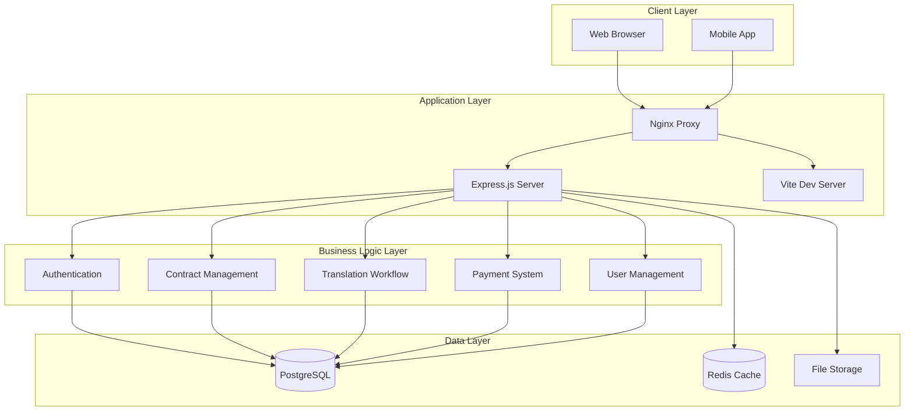
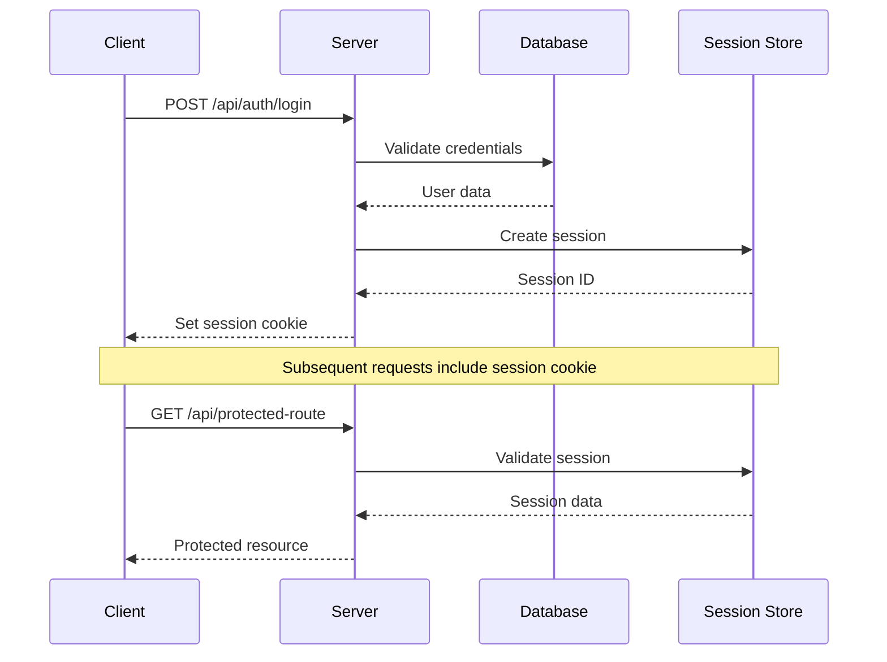
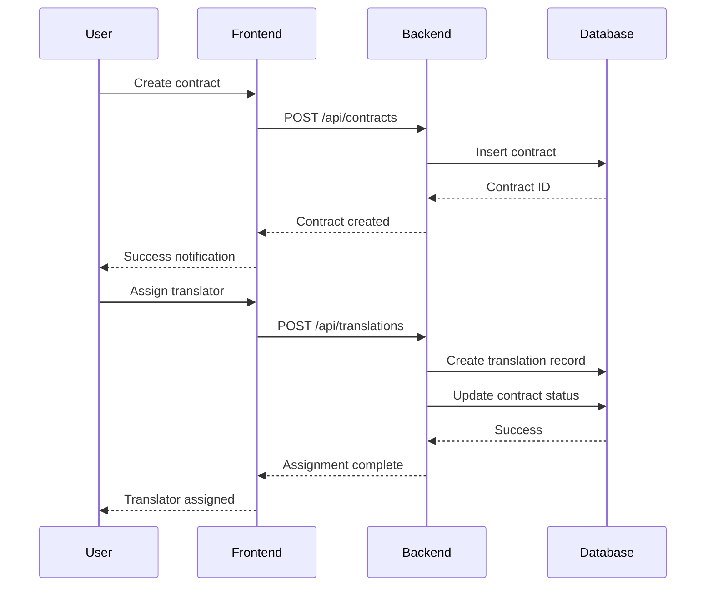
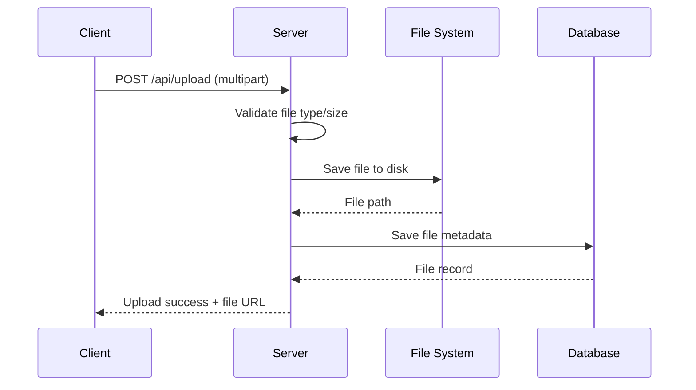

# 🏗️ System Architecture - OrientClassicsManager

> **Tổng quan kiến trúc hệ thống** OrientClassicsManager - Hệ thống quản lý dự án dịch thuật

## 📋 Mục lục

- [🎯 Architecture Overview](#-architecture-overview)
- [🔧 Technology Stack](#-technology-stack)
- [📊 System Components](#-system-components)
- [🔄 Data Flow](#-data-flow)
- [🛡️ Security Architecture](#️-security-architecture)
- [📈 Scalability & Performance](#-scalability--performance)

---

## 🎯 Architecture Overview

### High-Level Architecture



### Architecture Patterns

- **Monolithic Architecture**: Single deployable unit
- **Layered Architecture**: Clear separation of concerns
- **MVC Pattern**: Model-View-Controller separation
- **Repository Pattern**: Data access abstraction
- **Service Layer Pattern**: Business logic encapsulation

---

## 🔧 Technology Stack

### Frontend Stack
```typescript
// Core Technologies
React 19.2.0          // UI Library
TypeScript 5.6.3      // Type Safety
TailwindCSS 4.1.17    // Styling Framework
Vite 5.4.21           // Build Tool

// UI Components
Radix UI              // Headless Components
Lucide React          // Icons
Framer Motion         // Animations
React Hook Form       // Form Management

// State Management
TanStack Query        // Server State
React Context         // Client State
Zustand (optional)    // Global State
```

### Backend Stack
```typescript
// Core Technologies
Node.js 20.11.1       // Runtime
Express.js 4.21.2     // Web Framework
TypeScript 5.6.3      // Type Safety

// Database & ORM
PostgreSQL 12+        // Primary Database
Drizzle ORM 0.44.7    // Type-safe ORM
node-postgres         // Database Driver

// Authentication & Security
Passport.js           // Authentication
Express Session       // Session Management
bcrypt                // Password Hashing
CORS                  // Cross-Origin Requests
```

### DevOps & Tools
```yaml
Development:
  - tsx: TypeScript execution
  - nodemon: Auto-restart
  - ESLint: Code linting
  - Prettier: Code formatting

Database:
  - pgAdmin: Database management
  - Drizzle Kit: Schema migrations
  - pg_dump: Backup utilities

Deployment:
  - Docker: Containerization
  - PM2: Process management
  - Nginx: Reverse proxy
```

---

## 📊 System Components

### 1. Frontend Application (React)

#### Component Architecture
```
src/
├── components/
│   ├── ui/              # Base UI components
│   ├── contracts/       # Contract-specific components
│   ├── translations/    # Translation workflow components
│   ├── users/          # User management components
│   └── common/         # Shared components
├── lib/
│   ├── api.ts          # API client
│   ├── auth.ts         # Authentication utilities
│   └── utils.ts        # Helper functions
├── hooks/              # Custom React hooks
├── types/              # TypeScript definitions
└── main.tsx           # Application entry point
```

#### Key Features
- **Responsive Design**: Mobile-first approach
- **Real-time Updates**: WebSocket integration
- **Offline Support**: Service Worker caching
- **Accessibility**: WCAG 2.1 compliance
- **Internationalization**: Multi-language support

### 2. Backend Application (Express.js)

#### Service Architecture
```
server/
├── routes/             # API route definitions
├── middleware/         # Custom middleware
├── services/           # Business logic services
├── models/            # Data models
├── utils/             # Utility functions
├── config/            # Configuration files
└── index.ts           # Server entry point
```

#### Core Services
- **Authentication Service**: User login/logout, session management
- **Contract Service**: Contract CRUD, status management
- **Translation Service**: Workflow management, assignment
- **Payment Service**: Billing, payment tracking
- **File Service**: Upload, storage, retrieval
- **Notification Service**: Email, in-app notifications

### 3. Database Layer (PostgreSQL)

#### Schema Design
```sql
-- Core Tables
users                  -- User accounts and roles
contracts             -- Contract information
translations          -- Translation tasks
payments              -- Payment records
works                 -- Work items
reviews               -- Review and evaluation

-- Relationship Tables
contract_translations -- Contract-Translation mapping
user_translations     -- User-Translation assignments
payment_translations  -- Payment-Translation mapping

-- System Tables
sessions              -- User sessions
audit_logs           -- System audit trail
file_uploads         -- File metadata
```

#### Data Relationships
- **One-to-Many**: Contract → Translations
- **Many-to-Many**: Users ↔ Translations (assignments)
- **One-to-One**: Translation → Payment
- **Hierarchical**: Users → Roles → Permissions

---

## 🔄 Data Flow

### 1. User Authentication Flow



### 2. Contract Management Flow



### 3. File Upload Flow



---

## 🛡️ Security Architecture

### Authentication & Authorization

#### Session-based Authentication
```typescript
// Session configuration
app.use(session({
  secret: process.env.SESSION_SECRET,
  resave: false,
  saveUninitialized: false,
  store: new PostgreSQLStore({
    pool: db.pool,
    tableName: 'sessions',
  }),
  cookie: {
    secure: process.env.NODE_ENV === 'production',
    httpOnly: true,
    maxAge: 24 * 60 * 60 * 1000, // 24 hours
  },
}));
```

#### Role-based Access Control (RBAC)
```typescript
// Permission matrix
const permissions = {
  chu_nhiem: ['*'], // Full access
  pho_chu_nhiem: ['contracts:*', 'translations:*', 'users:read'],
  dich_gia: ['translations:read', 'translations:update'],
  // ... other roles
};

// Middleware
function requirePermission(permission: string) {
  return (req, res, next) => {
    const userRole = req.user.role;
    const userPermissions = permissions[userRole] || [];
    
    if (userPermissions.includes('*') || userPermissions.includes(permission)) {
      next();
    } else {
      res.status(403).json({ error: 'Insufficient permissions' });
    }
  };
}
```

### Data Security

#### Input Validation
```typescript
// Using Zod for validation
const createContractSchema = z.object({
  title: z.string().min(1).max(255),
  client_name: z.string().min(1).max(255),
  total_amount: z.number().positive(),
});

app.post('/api/contracts', (req, res) => {
  const validation = createContractSchema.safeParse(req.body);
  if (!validation.success) {
    return res.status(400).json({ error: validation.error });
  }
  // Process valid data
});
```

#### SQL Injection Prevention
```typescript
// Using parameterized queries with Drizzle
const user = await db
  .select()
  .from(users)
  .where(eq(users.id, userId)); // Safe parameterized query
```

#### XSS Prevention
```typescript
// Content Security Policy
app.use((req, res, next) => {
  res.setHeader(
    'Content-Security-Policy',
    "default-src 'self'; script-src 'self' 'unsafe-inline'; style-src 'self' 'unsafe-inline'"
  );
  next();
});
```

---

## 📈 Scalability & Performance

### Database Optimization

#### Indexing Strategy
```sql
-- Performance indexes
CREATE INDEX idx_users_role ON users(role);
CREATE INDEX idx_contracts_status ON contracts(status);
CREATE INDEX idx_translations_status_translator ON translations(status, translator_id);
CREATE INDEX idx_translations_deadline ON translations(deadline);

-- Partial indexes for active records
CREATE INDEX idx_active_contracts ON contracts(id) WHERE status IN ('approved', 'in_progress');
```

#### Connection Pooling
```typescript
// Database connection pool
const pool = new Pool({
  connectionString: process.env.DATABASE_URL,
  max: 20,                    // Maximum connections
  idleTimeoutMillis: 30000,   // Close idle connections
  connectionTimeoutMillis: 2000,
});
```

### Caching Strategy

#### Redis Caching
```typescript
// Cache frequently accessed data
const redis = new Redis(process.env.REDIS_URL);

// Cache user sessions
app.use(session({
  store: new RedisStore({ client: redis }),
  // ... other options
}));

// Cache API responses
async function getCachedUsers() {
  const cached = await redis.get('users:all');
  if (cached) return JSON.parse(cached);
  
  const users = await db.select().from(users);
  await redis.setex('users:all', 300, JSON.stringify(users)); // 5 min cache
  return users;
}
```

### Load Balancing

#### Nginx Configuration
```nginx
upstream app_servers {
    server localhost:5000;
    server localhost:5001;
    server localhost:5002;
}

server {
    listen 80;
    server_name orientclassics.com;
    
    location / {
        proxy_pass http://app_servers;
        proxy_set_header Host $host;
        proxy_set_header X-Real-IP $remote_addr;
    }
}
```

### Monitoring & Logging

#### Application Monitoring
```typescript
// Performance monitoring
import { performance } from 'perf_hooks';

function performanceMiddleware(req, res, next) {
  const start = performance.now();
  
  res.on('finish', () => {
    const duration = performance.now() - start;
    console.log(`${req.method} ${req.path} - ${duration.toFixed(2)}ms`);
  });
  
  next();
}
```

#### Error Tracking
```typescript
// Error handling middleware
app.use((error, req, res, next) => {
  // Log error
  logger.error('Application Error', {
    error: error.message,
    stack: error.stack,
    url: req.url,
    method: req.method,
    user: req.user?.id,
  });
  
  // Send error response
  res.status(500).json({
    success: false,
    error: process.env.NODE_ENV === 'production' 
      ? 'Internal Server Error' 
      : error.message,
  });
});
```

---

## 🚀 Deployment Architecture

### Development Environment
```yaml
Services:
  - Node.js: Development server
  - PostgreSQL: Local database
  - Vite: Frontend dev server
  - Hot reload: Enabled
```

### Production Environment
```yaml
Services:
  - Nginx: Reverse proxy + static files
  - PM2: Process manager (multiple instances)
  - PostgreSQL: Production database
  - Redis: Session store + caching
  - SSL: HTTPS termination
```

### Docker Deployment
```dockerfile
# Multi-stage build
FROM node:20-alpine AS builder
WORKDIR /app
COPY package*.json ./
RUN npm ci --only=production

FROM node:20-alpine AS runtime
WORKDIR /app
COPY --from=builder /app/node_modules ./node_modules
COPY . .
EXPOSE 5000
CMD ["npm", "start"]
```

---

## 📊 System Metrics

### Performance Targets
- **Response Time**: < 200ms (95th percentile)
- **Throughput**: 1000+ requests/second
- **Availability**: 99.9% uptime
- **Database**: < 50ms query time

### Monitoring Dashboards
- **Application Performance**: Response times, error rates
- **Database Performance**: Query performance, connection pool
- **System Resources**: CPU, memory, disk usage
- **Business Metrics**: Active users, contracts processed

---

*System Architecture Documentation for OrientClassicsManager v1.0 - Updated: 2024-11-27*
