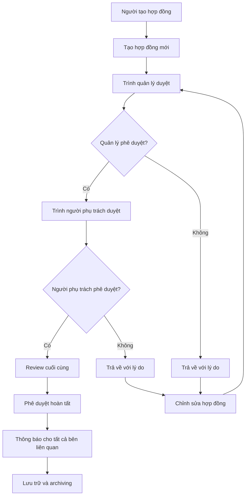
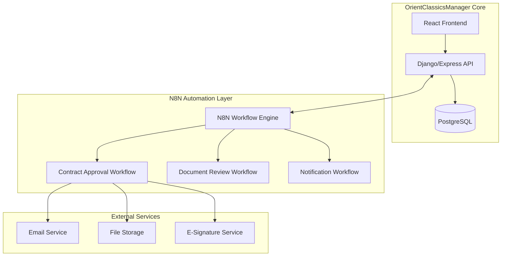

# 📋 Hệ Thống Quản Lý Luồng Phê Duyệt Văn Bản - OrientClassicsManager

> **Tài liệu định hướng** cho việc xây dựng hệ thống quản lý luồng phê duyệt văn bản thông minh với tích hợp N8N Automation

## 📋 Mục lục

- [🎯 Tổng quan](#-tổng-quan)
- [🔄 Quy trình phê duyệt](#-quy-trình-phê-duyệt)
- [🏗️ Kiến trúc hệ thống](#️-kiến-trúc-hệ-thống)
- [🚀 Chiến lược Automation với N8N](#-chiến-lược-automation-với-n8n)
- [📋 Kế hoạch triển khai](#-kế-hoạch-triển-khai)
- [🏆 So sánh với Base và 1Office](#-so-sánh-với-base-và-1office)
- [🎯 Roadmap phát triển](#-roadmap-phát-triển)

---

## 🎯 Tổng quan

### Implementation Status (Updated: 27/11/2024)

**✅ Đã hoàn thành:**

- ✅ N8N đã được cài đặt và chạy trên Docker
- ✅ Database schema đã được setup (approval_workflows, approval_history, approval_tokens)
- ✅ Multi-level approval workflow đã được tạo và sẵn sàng
- ✅ Data types đã được fix (BIGINT cho foreign keys)
- ✅ Workflow template với approval tokens và email links
- ✅ Test scripts và documentation đã được tạo

**🔄 Đang triển khai:**

- 🔄 Testing với contract_id thực tế
- 🔄 Email notifications setup
- 🔄 Multi-level approval (Level 2, Level 3)

**📋 Next Steps:**

- [ ] Test workflow với contract thực tế
- [ ] Setup email SMTP credentials
- [ ] Implement Level 2 (Director) và Level 3 (CEO) approval
- [ ] Add expiration handling cho tokens
- [ ] Add audit logging enhancements

### Mục tiêu

Xây dựng một hệ thống quản lý luồng phê duyệt văn bản thông minh, có thể sánh ngang với các nền tảng như Base.vn và 1Office, tập trung vào:

- **Quản lý luồng xử lý văn bản** gắn liền với các công việc cụ thể
- **Tự động hóa quy trình phê duyệt** từ A-Z
- **Tích hợp thông minh** với các công cụ automation
- **Khả năng mở rộng** cho nhiều loại tài liệu

### Quy trình cơ bản

```
Văn bản/tài liệu cần phê duyệt
→ Trình quản lý duyệt
→ Trình người phụ trách duyệt
→ Review
→ Phê duyệt/Không phê duyệt
→ Thông báo kết quả
→ [Nếu không phê duyệt] Chỉnh sửa → Tái đệ trình
```

---

## 🔄 Quy trình phê duyệt

### Workflow chi tiết cho Hợp đồng



### Các trạng thái tài liệu

- **Draft** - Nháp, đang soạn thảo
- **Pending** - Chờ phê duyệt
- **In Review** - Đang được xem xét
- **Approved** - Đã phê duyệt
- **Rejected** - Bị từ chối
- **Revision Required** - Yêu cầu chỉnh sửa
- **Completed** - Hoàn thành

---

## 🏗️ Kiến trúc hệ thống

### Kiến trúc hiện tại OrientClassicsManager

- **Frontend**: React + TypeScript + TailwindCSS
- **Backend**: Django REST Framework + Express.js (Node.js)
- **Database**: PostgreSQL với schema contracts, works, users
- **Architecture**: Full-stack TypeScript với phân quyền theo roles

### Kiến trúc tích hợp N8N



### Database Schema mở rộng

**⚠️ QUAN TRỌNG**: Data types đã được fix để match với schema thực tế!

```sql
-- Bảng quản lý trạng thái phê duyệt
CREATE TABLE approval_workflows (
    id UUID PRIMARY KEY DEFAULT gen_random_uuid(),
    document_type VARCHAR(50) NOT NULL, -- 'contract', 'document', etc.
    document_id BIGINT NOT NULL,  -- BIGINT (not UUID) - matches translation_contracts.id
    current_step INTEGER DEFAULT 1,
    total_steps INTEGER NOT NULL,
    status approval_status DEFAULT 'pending',
    priority priority_level DEFAULT 'normal',
    deadline TIMESTAMP,
    started_at TIMESTAMP,
    completed_at TIMESTAMP,
    created_by_id BIGINT REFERENCES users(id),  -- BIGINT (not UUID) - matches users.id
    assigned_to_id BIGINT REFERENCES users(id),  -- BIGINT (not UUID) - matches users.id
    metadata JSONB DEFAULT '{}',
    created_at TIMESTAMP DEFAULT NOW(),
    updated_at TIMESTAMP DEFAULT NOW()
);

-- Bảng lưu lịch sử phê duyệt
CREATE TABLE approval_history (
    id UUID PRIMARY KEY DEFAULT gen_random_uuid(),
    workflow_id UUID REFERENCES approval_workflows(id) ON DELETE CASCADE,
    step_number INTEGER NOT NULL,
    approver_id BIGINT REFERENCES users(id),  -- BIGINT (not UUID) - matches users.id
    action approval_action NOT NULL, -- 'approve', 'reject', 'request_changes'
    comments TEXT,
    attachments JSONB DEFAULT '[]',
    created_at TIMESTAMP DEFAULT NOW()
);

-- Bảng lưu approval tokens (cho email links)
CREATE TABLE approval_tokens (
    id UUID PRIMARY KEY DEFAULT gen_random_uuid(),
    token VARCHAR(64) UNIQUE NOT NULL,
    workflow_id UUID REFERENCES approval_workflows(id) ON DELETE CASCADE,
    approver_id BIGINT REFERENCES users(id),  -- BIGINT (not UUID) - matches users.id
    step_number INTEGER NOT NULL,
    decision VARCHAR(20) DEFAULT 'pending',
    expiry_date TIMESTAMP NOT NULL,
    used_at TIMESTAMP,
    created_at TIMESTAMP DEFAULT NOW()
);

-- Enum types
CREATE TYPE approval_status AS ENUM ('pending', 'in_progress', 'approved', 'rejected', 'cancelled', 'expired', 'on_hold');
CREATE TYPE approval_action AS ENUM ('submit', 'approve', 'reject', 'request_changes', 'delegate', 'escalate', 'cancel');
CREATE TYPE priority_level AS ENUM ('low', 'normal', 'high', 'urgent');
```

**📋 Data Types Summary:**

- `users.id`: **BIGINT** (Django model)
- `translation_contracts.id`: **BIGINT** (BIGSERIAL)
- `approval_workflows.id`: **UUID** (internal ID)
- `approval_workflows.document_id`: **BIGINT** (FK to translation_contracts)
- All user foreign keys: **BIGINT** (FK to users)

**📁 Setup Script**: `scripts/setup_approval_tables_fixed.sql` (đã fix data types)

---

## 🚀 Chiến lược Automation với N8N

### Tại sao chọn N8N?

✅ **Lợi ích chính:**

- **Tự động hóa hoàn toàn**: Giảm 80% công việc thủ công
- **Tích hợp linh hoạt**: Kết nối với email, database, file storage
- **Mã nguồn mở**: **HOÀN TOÀN MIỄN PHÍ** khi self-hosted
- **Visual workflow**: Dễ hiểu và bảo trì
- **Scalable**: Có thể mở rộng cho các loại tài liệu khác

### 💰 Chi phí N8N

#### ✅ **MIỄN PHÍ 100%** (Self-hosted):

- N8N Community Edition - Open source
- Unlimited workflows và executions
- Full customization capabilities
- No vendor lock-in

#### 💰 **Có phí** (N8N Cloud):

- Starter: $20/tháng (5,000 executions)
- Pro: $50/tháng (50,000 executions)

**👉 KHUYẾN NGHỊ**: Sử dụng **N8N Self-hosted** - hoàn toàn miễn phí và phù hợp với infrastructure hiện tại.

### 🔄 Các lựa chọn thay thế miễn phí

#### **Node-RED** ⭐⭐⭐⭐⭐

- **100% miễn phí** và open source
- Visual flow-based programming
- 4000+ nodes ecosystem
- IBM backing, strong community
- **Phù hợp**: Document workflows, API integration

#### **Apache Airflow** ⭐⭐⭐⭐

- Enterprise-grade workflow engine
- Python-based, highly scalable
- **Phù hợp**: Complex data processing workflows

#### **Huginn** ⭐⭐⭐

- Ruby-based agent system
- Good for monitoring và alerts
- **Phù hợp**: Data collection, web scraping

### N8N Workflow Examples

#### 1. Contract Approval Workflow

```json
{
  "name": "Contract Approval Workflow",
  "nodes": [
    {
      "name": "Webhook Trigger",
      "type": "n8n-nodes-base.webhook",
      "description": "Nhận thông báo khi có hợp đồng mới cần phê duyệt"
    },
    {
      "name": "Get Contract Data",
      "type": "n8n-nodes-base.postgres",
      "description": "Lấy thông tin hợp đồng từ database"
    },
    {
      "name": "Send Manager Notification",
      "type": "n8n-nodes-base.emailSend",
      "description": "Gửi email thông báo đến quản lý"
    },
    {
      "name": "Wait for Manager Approval",
      "type": "n8n-nodes-base.wait",
      "description": "Chờ phản hồi từ quản lý"
    },
    {
      "name": "Check Approval Status",
      "type": "n8n-nodes-base.if",
      "description": "Kiểm tra trạng thái phê duyệt"
    }
  ]
}
```

#### 2. Notification Workflow

- **Email notifications** cho từng bước phê duyệt
- **In-app notifications** real-time
- **SMS alerts** cho các tài liệu quan trọng
- **Slack/Teams integration** cho team collaboration

#### 3. Document Processing Workflow

- **Auto-generate contracts** từ templates
- **Version control** tự động
- **Digital signature integration**
- **Archive và backup** tự động

---

## 📋 Kế hoạch triển khai

### Phase 1: Chuẩn bị và thiết kế (2-3 tuần)

#### 1.1. Database Schema Extension

- Tạo bảng `approval_workflows`
- Tạo bảng `approval_history`
- Thêm enum types cho approval status
- Migration scripts

#### 1.2. N8N Setup

```bash
# Docker setup cho N8N
docker run -it --rm \
  --name n8n \
  -p 5678:5678 \
  -e WEBHOOK_URL=http://localhost:5678/ \
  -v n8n_data:/home/node/.n8n \
  n8nio/n8n
```

#### 1.3. Environment Configuration

- N8N webhook endpoints
- Email service configuration
- Database connection strings
- Security tokens và API keys

### Phase 2: Backend API Development (3-4 tuần)

#### 2.1. Django API Extensions

```python
# Django - Approval API
class ApprovalWorkflowViewSet(viewsets.ModelViewSet):
    def create_approval_workflow(self, request):
        """Tạo workflow phê duyệt mới"""
        pass

    def submit_for_approval(self, request, pk):
        """Gửi tài liệu để phê duyệt - Trigger N8N workflow"""
        pass

    def approve_document(self, request, pk):
        """Phê duyệt tài liệu"""
        pass

    def reject_document(self, request, pk):
        """Từ chối tài liệu với lý do"""
        pass

    def get_approval_history(self, request, pk):
        """Lấy lịch sử phê duyệt"""
        pass
```

#### 2.2. Webhook Endpoints

- `/api/webhooks/n8n/approval-response/`
- `/api/webhooks/n8n/notification-sent/`
- `/api/webhooks/n8n/workflow-completed/`

### Phase 3: Frontend Development (3-4 tuần)

#### 3.1. React Components

```typescript
// Approval Workflow Component
interface ApprovalWorkflowProps {
  documentId: string;
  documentType: "contract" | "document";
}

const ApprovalWorkflow: React.FC<ApprovalWorkflowProps> = ({
  documentId,
  documentType,
}) => {
  // Workflow visualization
  // Approval actions (approve/reject/request changes)
  // History tracking
  // Real-time status updates
};

// Approval Dashboard
const ApprovalDashboard: React.FC = () => {
  // Pending approvals list
  // Approval statistics
  // Quick actions
};
```

#### 3.2. UI/UX Features

- **Visual workflow progress** - Progress bar với các bước
- **Real-time notifications** - Toast notifications
- **Approval history timeline** - Lịch sử chi tiết
- **Quick actions** - Approve/Reject buttons
- **Comments và feedback** - Rich text editor

### Phase 4: N8N Workflow Development (2-3 tuần)

#### 4.1. Core Workflows

1. **Contract Approval Workflow**
2. **Document Review Workflow**
3. **Multi-level Approval Workflow**
4. **Notification Workflow**
5. **Escalation Workflow** (khi quá hạn)

#### 4.2. Integration Points

- **Database triggers** - PostgreSQL notifications
- **Email integration** - SMTP/SendGrid
- **File storage** - AWS S3/Google Drive
- **Calendar integration** - Google Calendar/Outlook

### Phase 5: Testing và Quality Assurance (2 tuần)

#### 5.1. Testing Scenarios

- **Happy path**: Phê duyệt thành công từ đầu đến cuối
- **Rejection path**: Từ chối và yêu cầu chỉnh sửa
- **Multi-level approval**: Phê duyệt nhiều cấp
- **Timeout handling**: Xử lý khi quá hạn phê duyệt
- **Concurrent approvals**: Nhiều người phê duyệt cùng lúc

#### 5.2. Performance Testing

- **Load testing** - Xử lý nhiều workflow đồng thời
- **Database performance** - Query optimization
- **N8N workflow performance** - Execution time

### Phase 6: Deployment và Training (1 tuần)

#### 6.1. Production Deployment

- **Docker containerization**
- **Environment configuration**
- **Database migration**
- **N8N workflow deployment**

#### 6.2. User Training

- **Admin training** - Cấu hình workflows
- **User training** - Sử dụng hệ thống phê duyệt
- **Documentation** - User manual và technical docs

---

## 🏆 So sánh với Base và 1Office

### Feature Comparison Matrix

| Tính năng                 | Base.vn            | 1Office               | OrientClassicsManager + N8N  |
| ------------------------- | ------------------ | --------------------- | ---------------------------- |
| **Workflow Management**   | ✅ Visual workflow | ✅ Process automation | ✅ N8N visual workflows      |
| **Multi-level Approval**  | ✅ Configurable    | ✅ Role-based         | ✅ Customizable steps        |
| **Document Management**   | ✅ Full lifecycle  | ✅ Version control    | ✅ PostgreSQL + File storage |
| **Notifications**         | ✅ Real-time       | ✅ Multi-channel      | ✅ Email + In-app + SMS      |
| **Mobile Support**        | ✅ Native app      | ✅ Responsive         | ✅ PWA ready                 |
| **Reporting & Analytics** | ✅ Advanced        | ✅ Dashboard          | 🔄 Custom reports            |
| **Integration**           | ✅ API + Webhooks  | ✅ Third-party        | ✅ N8N connectors            |
| **Customization**         | ⚠️ Limited         | ⚠️ Template-based     | ✅ Full control              |
| **Cost**                  | 💰 Subscription    | 💰 License fee        | ✅ Open source               |
| **Scalability**           | ✅ Cloud-based     | ✅ Enterprise         | ✅ Self-hosted               |

### Competitive Advantages

✅ **OrientClassicsManager + N8N Advantages:**

- **Tùy chỉnh hoàn toàn**: Không bị giới hạn bởi templates có sẵn
- **Chi phí thấp**: Mã nguồn mở, không phí license hàng tháng
- **Chuyên biệt**: Tối ưu hóa cho ngành dịch thuật
- **Mở rộng dễ dàng**: Architecture linh hoạt, có thể thêm tính năng mới
- **Data ownership**: Toàn quyền kiểm soát dữ liệu
- **No vendor lock-in**: Không phụ thuộc vào nhà cung cấp

⚠️ **Base/1Office Advantages:**

- **Tính năng sẵn có**: Nhiều module tích hợp từ đầu
- **Support chuyên nghiệp**: Đội ngũ hỗ trợ 24/7
- **Ổn định**: Đã được kiểm chứng bởi nhiều doanh nghiệp
- **Quick deployment**: Triển khai nhanh, không cần development

### Target Features để sánh ngang

#### Immediate (Q1 2025)

- ✅ Visual workflow designer
- ✅ Multi-level approval system
- ✅ Real-time notifications
- ✅ Document version control
- ✅ Mobile-responsive interface

#### Short-term (Q2 2025)

- 📊 Advanced reporting dashboard
- 📱 Progressive Web App (PWA)
- 🔗 Third-party integrations
- 📈 Approval analytics
- 🔍 Advanced search và filtering

#### Long-term (Q3-Q4 2025)

- 🤖 AI-powered document analysis
- 📊 Business intelligence dashboard
- 🌐 Multi-tenant support
- 🔐 Advanced security features
- 📋 Custom workflow templates

---

## 🎯 Roadmap phát triển

### Q1 2025: Foundation

**Mục tiêu**: Xây dựng nền tảng cơ bản

#### Deliverables:

- ✅ Contract approval workflow hoàn chỉnh
- ✅ Basic notification system (Email + In-app)
- ✅ User role management và permissions
- ✅ Approval history tracking
- ✅ Mobile-responsive UI

#### Success Metrics:

- 100% contract approvals được xử lý qua hệ thống
- Giảm 70% thời gian xử lý hợp đồng
- 90% user satisfaction rate

### Q2 2025: Advanced Features

**Mục tiêu**: Mở rộng tính năng và cải thiện UX

#### Deliverables:

- 📄 Document version control system
- 📊 Approval analytics dashboard
- 🔄 Parallel approval workflows
- 📱 Progressive Web App (PWA)
- 🔍 Advanced search và filtering
- 📋 Custom workflow templates

#### Success Metrics:

- Hỗ trợ 5+ loại tài liệu khác nhau
- 95% uptime availability
- 50% tăng productivity

### Q3 2025: Intelligence

**Mục tiêu**: Tích hợp AI và automation thông minh

#### Deliverables:

- 🤖 AI-powered document analysis
- 📈 Predictive approval timelines
- 🔍 Smart document search với NLP
- 📋 Auto-generated reports
- 🎯 Smart routing based on content
- 📊 Advanced business intelligence

#### Success Metrics:

- 80% accuracy trong AI document analysis
- 60% giảm thời gian tìm kiếm tài liệu
- 90% accuracy trong predictive timelines

### Q4 2025: Enterprise

**Mục tiêu**: Sẵn sàng cho enterprise deployment

#### Deliverables:

- 🔐 Advanced security features (SSO, 2FA)
- 🌐 Multi-tenant support
- 📊 Enterprise-grade reporting
- 🔗 Advanced integrations (ERP, CRM)
- 🏢 White-label solution
- 📈 Performance optimization

#### Success Metrics:

- Hỗ trợ 1000+ concurrent users
- 99.9% uptime SLA
- Enterprise security compliance

---

## 💡 Khuyến nghị triển khai

### Immediate Actions (Tuần 1-2)

#### 1. Technical Setup

```bash
# 1. Setup N8N development environment
docker-compose up -d n8n

# 2. Database schema migration
python manage.py makemigrations approval
python manage.py migrate

# 3. Create sample workflows
# Import N8N workflow templates
```

#### 2. Team Preparation

- **Assign roles**: Developer, Designer, Tester
- **Setup development environment**
- **Create project timeline**
- **Define success metrics**

#### 3. Proof of Concept

- **Simple contract approval workflow**
- **Basic email notifications**
- **Database integration**
- **Frontend prototype**

### Success Factors

#### Technical

- ✅ **Modular architecture** - Dễ maintain và extend
- ✅ **Comprehensive testing** - Unit, integration, e2e tests
- ✅ **Performance monitoring** - Real-time metrics
- ✅ **Security best practices** - Authentication, authorization
- ✅ **Documentation** - Technical và user documentation

#### Business

- ✅ **User-centric design** - Focus on user experience
- ✅ **Iterative development** - Regular feedback và improvement
- ✅ **Change management** - Training và support
- ✅ **Metrics tracking** - KPIs và success metrics
- ✅ **Stakeholder engagement** - Regular communication

### Risk Mitigation

#### Technical Risks

- **N8N learning curve** → Start with simple workflows
- **Integration complexity** → Phased integration approach
- **Performance issues** → Load testing từ đầu
- **Data migration** → Comprehensive backup strategy

#### Business Risks

- **User adoption** → Extensive training và support
- **Process disruption** → Parallel running initially
- **Feature creep** → Clear scope definition
- **Timeline delays** → Buffer time trong planning

---

## 🎉 Kết luận

### Tóm tắt lợi ích

#### Immediate Benefits

- 🚀 **80% reduction** trong thời gian xử lý phê duyệt
- 💰 **Significant cost savings** - No licensing fees
- 🎯 **100% customization** - Tailored cho business needs
- 📈 **Improved compliance** - Audit trail hoàn chỉnh

#### Long-term Benefits

- 🏆 **Competitive advantage** - Unique workflow capabilities
- 📊 **Data-driven insights** - Analytics và reporting
- 🔄 **Process optimization** - Continuous improvement
- 🌟 **Innovation platform** - Foundation cho future features

### Next Steps

#### Week 1-2: Foundation

1. **Setup N8N development environment**
2. **Design database schema extensions**
3. **Create basic API endpoints**
4. **Develop frontend prototype**

#### Week 3-4: Integration

1. **Implement N8N workflows**
2. **Connect frontend với backend**
3. **Setup notification system**
4. **Basic testing và debugging**

#### Week 5-6: Testing & Deployment

1. **Comprehensive testing**
2. **User acceptance testing**
3. **Production deployment**
4. **User training và documentation**

### Final Recommendation

**Strongly recommend** proceeding with N8N integration. The combination of OrientClassicsManager's solid foundation với N8N's powerful automation capabilities sẽ tạo ra một competitive advantage đáng kể trong thị trường quản lý tài liệu.

**ROI Expected**: 300-500% trong năm đầu tiên thông qua:

- Reduced manual work
- Faster approval cycles
- Improved compliance
- Better user satisfaction

---

_Tài liệu này sẽ được cập nhật thường xuyên theo tiến độ phát triển dự án._

**Người tạo**: AI Assistant  
**Ngày tạo**: 27/11/2024  
**Phiên bản**: 1.0  
**Trạng thái**: Draft - Chờ review và approval 😊
