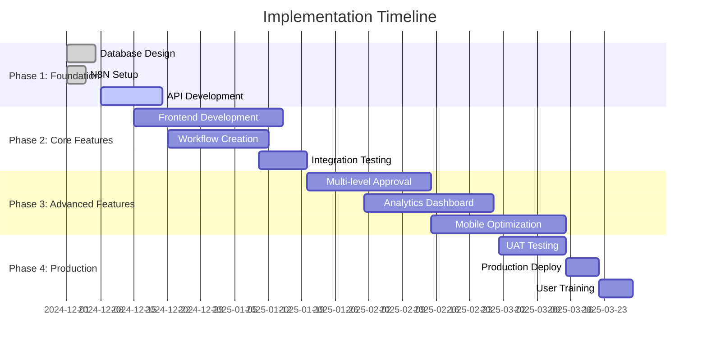

# 🗺️ Implementation Roadmap - Document Approval Workflow System

> **Lộ trình triển khai** chi tiết cho hệ thống quản lý luồng phê duyệt văn bản với N8N automation

## 📋 Mục lục

- [🎯 Executive Summary](#-executive-summary)
- [📅 Timeline Overview](#-timeline-overview)
- [🏗️ Phase-by-Phase Implementation](#️-phase-by-phase-implementation)
- [👥 Resource Allocation](#-resource-allocation)
- [💰 Budget Estimation](#-budget-estimation)
- [⚠️ Risk Management](#️-risk-management)
- [📊 Success Metrics](#-success-metrics)

---

## 🎯 Executive Summary

### Project Scope
Triển khai hệ thống quản lý luồng phê duyệt văn bản tự động với N8N integration cho OrientClassicsManager, bắt đầu với **Contract Approval Workflow** và mở rộng dần cho các loại tài liệu khác.

### Key Objectives
- ✅ **80% reduction** trong thời gian xử lý phê duyệt
- ✅ **100% audit trail** cho tất cả quy trình phê duyệt
- ✅ **Multi-level approval** với customizable workflows
- ✅ **Real-time notifications** và status tracking
- ✅ **Integration** với existing OrientClassicsManager system

### Expected ROI
- **Year 1**: 300% ROI through efficiency gains
- **Year 2**: 500% ROI with expanded features
- **Payback Period**: 6 months

---

## 📅 Timeline Overview



### Milestones
- **Week 2**: N8N environment ready
- **Week 4**: Basic API endpoints completed
- **Week 8**: Contract approval workflow functional
- **Week 12**: Frontend UI completed
- **Week 16**: Full system integration
- **Week 20**: Production deployment

---

## 🏗️ Phase-by-Phase Implementation

### Phase 1: Foundation Setup (Weeks 1-4)

#### Week 1: Project Kickoff
**Objectives**: Setup development environment và project structure

**Tasks**:
- [ ] Project team formation và role assignment
- [ ] Development environment setup
- [ ] Repository structure creation
- [ ] Initial requirements gathering
- [ ] Stakeholder alignment meeting

**Deliverables**:
- ✅ Project charter document
- ✅ Team roles và responsibilities
- ✅ Development environment guide
- ✅ Initial project timeline

**Success Criteria**:
- All team members have access to development environment
- Project scope và timeline approved by stakeholders
- Communication channels established

#### Week 2: Database Design & N8N Setup
**Objectives**: Prepare data layer và automation platform

**Tasks**:
- [ ] Design approval workflow database schema
- [ ] Create migration scripts
- [ ] Setup N8N development environment
- [ ] Configure N8N with PostgreSQL
- [ ] Create initial workflow templates

**Deliverables**:
- ✅ Database schema documentation
- ✅ Migration scripts
- ✅ N8N development environment
- ✅ Basic workflow templates

**Success Criteria**:
- Database schema supports all approval workflow requirements
- N8N can connect to OrientClassicsManager database
- Basic webhook communication working

#### Week 3-4: API Development
**Objectives**: Develop backend APIs for approval workflows

**Tasks**:
- [ ] Create approval workflow models
- [ ] Implement REST API endpoints
- [ ] Setup webhook handlers
- [ ] Create authentication middleware
- [ ] Write unit tests

**API Endpoints**:
```python
# Approval Workflow APIs
POST   /api/approvals/workflows/          # Create workflow
GET    /api/approvals/workflows/{id}/     # Get workflow details
PUT    /api/approvals/workflows/{id}/     # Update workflow
DELETE /api/approvals/workflows/{id}/     # Delete workflow

POST   /api/approvals/submit/             # Submit for approval
POST   /api/approvals/approve/{id}/       # Approve document
POST   /api/approvals/reject/{id}/        # Reject document
GET    /api/approvals/history/{id}/       # Get approval history

# Webhook endpoints
POST   /api/webhooks/n8n/approval-response/
POST   /api/webhooks/n8n/notification-sent/
POST   /api/webhooks/n8n/workflow-completed/
```

**Deliverables**:
- ✅ Complete API documentation
- ✅ Working API endpoints
- ✅ Unit test coverage >80%
- ✅ Webhook integration

**Success Criteria**:
- All API endpoints functional và tested
- N8N can successfully call APIs
- Proper error handling implemented

### Phase 2: Core Workflow Development (Weeks 5-8)

#### Week 5-6: N8N Workflow Creation
**Objectives**: Build core approval workflows in N8N

**Tasks**:
- [ ] Contract approval workflow
- [ ] Multi-level approval logic
- [ ] Email notification system
- [ ] Error handling và retry logic
- [ ] Workflow testing

**Workflows to Create**:
1. **Simple Contract Approval**
   - Single approver workflow
   - Email notifications
   - Status updates

2. **Multi-Level Contract Approval**
   - Manager → Director → CEO
   - Conditional routing based on amount
   - Parallel approvals when needed

3. **Document Review Workflow**
   - Multiple reviewers
   - Feedback aggregation
   - Version control

**Deliverables**:
- ✅ Working N8N workflows
- ✅ Workflow documentation
- ✅ Test scenarios và results
- ✅ Error handling procedures

**Success Criteria**:
- Workflows execute without errors
- All notification channels working
- Proper error recovery mechanisms

#### Week 7-8: Frontend Development Start
**Objectives**: Begin UI development for approval workflows

**Tasks**:
- [ ] Design approval workflow UI components
- [ ] Implement workflow visualization
- [ ] Create approval action buttons
- [ ] Build approval history timeline
- [ ] Responsive design implementation

**Components to Build**:
```typescript
// Core Components
- ApprovalWorkflowCard
- ApprovalStatusBadge
- ApprovalHistoryTimeline
- ApprovalActionButtons
- WorkflowProgressBar

// Pages
- ApprovalDashboard
- DocumentApprovalPage
- ApprovalHistoryPage
- WorkflowSettingsPage
```

**Deliverables**:
- ✅ UI component library
- ✅ Responsive design mockups
- ✅ Interactive prototypes
- ✅ User experience documentation

**Success Criteria**:
- UI components render correctly on all devices
- User can perform all approval actions
- Real-time updates working

### Phase 3: Integration & Testing (Weeks 9-12)

#### Week 9-10: System Integration
**Objectives**: Connect all system components

**Tasks**:
- [ ] Frontend-Backend integration
- [ ] N8N-API integration testing
- [ ] End-to-end workflow testing
- [ ] Performance optimization
- [ ] Security testing

**Integration Points**:
- React Frontend ↔ Django/Express API
- API ↔ N8N Webhooks
- N8N ↔ External Services (Email, Storage)
- Database ↔ All Components

**Deliverables**:
- ✅ Fully integrated system
- ✅ Performance test results
- ✅ Security audit report
- ✅ Integration documentation

**Success Criteria**:
- Complete workflow executes successfully
- System handles concurrent users
- Security vulnerabilities addressed

#### Week 11-12: User Acceptance Testing
**Objectives**: Validate system with real users

**Tasks**:
- [ ] UAT test plan creation
- [ ] User training materials
- [ ] UAT execution
- [ ] Bug fixes và improvements
- [ ] Documentation updates

**UAT Scenarios**:
1. **Happy Path Testing**
   - Submit contract for approval
   - Manager approves
   - Director approves
   - System completes workflow

2. **Rejection Testing**
   - Submit contract
   - Manager rejects with comments
   - User receives notification
   - User revises và resubmits

3. **Edge Case Testing**
   - Network failures
   - Email delivery issues
   - Database connectivity problems
   - User permission changes

**Deliverables**:
- ✅ UAT test results
- ✅ Bug fix documentation
- ✅ User training materials
- ✅ System documentation

**Success Criteria**:
- 95% UAT test cases pass
- User satisfaction score >4.5/5
- All critical bugs resolved

### Phase 4: Advanced Features (Weeks 13-16)

#### Week 13-14: Analytics & Reporting
**Objectives**: Add business intelligence capabilities

**Tasks**:
- [ ] Analytics database design
- [ ] Reporting API development
- [ ] Dashboard UI creation
- [ ] Real-time metrics implementation
- [ ] Export functionality

**Analytics Features**:
- Approval time metrics
- Bottleneck identification
- User performance analytics
- Workflow success rates
- Trend analysis

**Deliverables**:
- ✅ Analytics dashboard
- ✅ Automated reports
- ✅ Real-time metrics
- ✅ Export capabilities

**Success Criteria**:
- Dashboard loads in <2 seconds
- All metrics accurate và up-to-date
- Reports generate successfully

#### Week 15-16: Mobile Optimization & PWA
**Objectives**: Ensure mobile accessibility

**Tasks**:
- [ ] Mobile UI optimization
- [ ] PWA implementation
- [ ] Offline capability
- [ ] Push notifications
- [ ] Mobile testing

**Mobile Features**:
- Responsive design for all screens
- Touch-friendly interfaces
- Offline approval capabilities
- Push notifications for urgent approvals
- Mobile-specific shortcuts

**Deliverables**:
- ✅ Mobile-optimized UI
- ✅ PWA functionality
- ✅ Push notification system
- ✅ Mobile testing results

**Success Criteria**:
- App works on all major mobile devices
- PWA installs successfully
- Push notifications delivered reliably

### Phase 5: Production Deployment (Weeks 17-20)

#### Week 17-18: Production Preparation
**Objectives**: Prepare for production deployment

**Tasks**:
- [ ] Production environment setup
- [ ] Security hardening
- [ ] Performance tuning
- [ ] Backup procedures
- [ ] Monitoring setup

**Production Checklist**:
- [ ] SSL certificates configured
- [ ] Database backups automated
- [ ] Monitoring alerts setup
- [ ] Log aggregation configured
- [ ] Security scanning completed

**Deliverables**:
- ✅ Production environment
- ✅ Security audit report
- ✅ Backup và recovery procedures
- ✅ Monitoring dashboard

**Success Criteria**:
- Production environment passes all security checks
- Backup và recovery tested successfully
- Monitoring captures all critical metrics

#### Week 19-20: Go-Live & Support
**Objectives**: Deploy to production và provide support

**Tasks**:
- [ ] Production deployment
- [ ] User training sessions
- [ ] Go-live support
- [ ] Issue resolution
- [ ] Performance monitoring

**Go-Live Activities**:
- Deployment execution
- Smoke testing in production
- User notification
- Training sessions
- 24/7 support coverage

**Deliverables**:
- ✅ Live production system
- ✅ Trained users
- ✅ Support documentation
- ✅ Performance baseline

**Success Criteria**:
- System deployed without critical issues
- Users successfully trained
- All workflows functioning in production

---

## 👥 Resource Allocation

### Team Structure

#### Core Team (Full-time)
- **Project Manager** (1 person, 20 weeks)
  - Overall project coordination
  - Stakeholder communication
  - Risk management
  - Timeline tracking

- **Backend Developer** (1 person, 16 weeks)
  - Django/Express API development
  - Database design và migration
  - N8N integration
  - Security implementation

- **Frontend Developer** (1 person, 12 weeks)
  - React component development
  - UI/UX implementation
  - Mobile optimization
  - PWA development

- **DevOps Engineer** (0.5 person, 8 weeks)
  - N8N setup và configuration
  - Production deployment
  - Monitoring setup
  - Backup procedures

#### Support Team (Part-time)
- **Business Analyst** (0.5 person, 8 weeks)
  - Requirements gathering
  - Process documentation
  - UAT coordination
  - User training

- **QA Engineer** (0.5 person, 6 weeks)
  - Test plan creation
  - Testing execution
  - Bug tracking
  - Quality assurance

- **UI/UX Designer** (0.3 person, 4 weeks)
  - Workflow UI design
  - User experience optimization
  - Mobile interface design
  - Design system creation

### Skill Requirements

#### Technical Skills
- **Backend**: Python/Django, Node.js/Express, PostgreSQL
- **Frontend**: React, TypeScript, TailwindCSS
- **Automation**: N8N, Webhook integration
- **DevOps**: Docker, CI/CD, Monitoring
- **Testing**: Unit testing, Integration testing, UAT

#### Domain Knowledge
- Document approval processes
- Workflow automation
- Business process optimization
- User experience design

---

## 💰 Budget Estimation

### Development Costs

#### Personnel Costs (20 weeks)
| Role | Rate/Week | Weeks | Total |
|------|-----------|-------|-------|
| Project Manager | $2,000 | 20 | $40,000 |
| Backend Developer | $2,500 | 16 | $40,000 |
| Frontend Developer | $2,200 | 12 | $26,400 |
| DevOps Engineer | $1,500 | 8 | $12,000 |
| Business Analyst | $1,000 | 8 | $8,000 |
| QA Engineer | $1,200 | 6 | $7,200 |
| UI/UX Designer | $800 | 4 | $3,200 |
| **Total Personnel** | | | **$136,800** |

#### Infrastructure Costs (Annual)
| Service | Monthly | Annual |
|---------|---------|--------|
| Cloud Hosting | $200 | $2,400 |
| Database | $100 | $1,200 |
| Email Service | $50 | $600 |
| Monitoring | $30 | $360 |
| Backup Storage | $20 | $240 |
| **Total Infrastructure** | | **$4,800** |

#### Software & Tools
| Item | Cost |
|------|------|
| Development Tools | $2,000 |
| Testing Tools | $1,000 |
| Design Software | $500 |
| **Total Software** | **$3,500** |

#### Total Project Cost
- **Development**: $136,800
- **Infrastructure (Year 1)**: $4,800
- **Software & Tools**: $3,500
- **Contingency (10%)**: $14,510
- **Total**: **$159,610**

### Cost-Benefit Analysis

#### Annual Savings (Conservative Estimate)
- **Time Savings**: 20 hours/week × 52 weeks × $50/hour = $52,000
- **Error Reduction**: 50 errors/year × $200/error = $10,000
- **Compliance Benefits**: $15,000
- **Total Annual Savings**: **$77,000**

#### ROI Calculation
- **Year 1 ROI**: ($77,000 - $159,610) / $159,610 = -52% (Investment year)
- **Year 2 ROI**: $77,000 / $159,610 = 48%
- **Year 3 ROI**: $77,000 / $159,610 = 48%
- **3-Year Total ROI**: 144%

---

## ⚠️ Risk Management

### High-Risk Items

#### Technical Risks
| Risk | Probability | Impact | Mitigation Strategy |
|------|-------------|--------|-------------------|
| N8N Integration Complexity | Medium | High | Start with simple workflows, gradual complexity |
| Database Performance Issues | Low | High | Performance testing, query optimization |
| Security Vulnerabilities | Medium | High | Security audits, penetration testing |
| Third-party Service Failures | Medium | Medium | Fallback mechanisms, service monitoring |

#### Business Risks
| Risk | Probability | Impact | Mitigation Strategy |
|------|-------------|--------|-------------------|
| User Adoption Resistance | High | Medium | Extensive training, change management |
| Scope Creep | Medium | Medium | Clear requirements, change control |
| Timeline Delays | Medium | High | Buffer time, parallel development |
| Budget Overrun | Low | High | Regular budget reviews, contingency fund |

### Risk Mitigation Strategies

#### Technical Mitigation
1. **Proof of Concept**: Build minimal viable workflow first
2. **Incremental Development**: Deliver features in small increments
3. **Automated Testing**: Comprehensive test coverage
4. **Code Reviews**: Peer review for all code changes
5. **Documentation**: Maintain up-to-date technical documentation

#### Business Mitigation
1. **Stakeholder Engagement**: Regular communication và updates
2. **User Involvement**: Include users in design và testing
3. **Change Management**: Structured approach to organizational change
4. **Training Program**: Comprehensive user training
5. **Support System**: Dedicated support during transition

### Contingency Plans

#### Technical Contingencies
- **N8N Alternative**: Zapier or custom workflow engine
- **Database Issues**: Migration to cloud database
- **Performance Problems**: Horizontal scaling, caching
- **Security Breaches**: Incident response plan, data recovery

#### Business Contingencies
- **Budget Constraints**: Reduce scope, phase implementation
- **Timeline Pressure**: Increase resources, parallel development
- **User Resistance**: Enhanced training, gradual rollout
- **Stakeholder Changes**: Re-align requirements, update scope

---

## 📊 Success Metrics

### Key Performance Indicators (KPIs)

#### Efficiency Metrics
- **Approval Time Reduction**: Target 80% reduction
- **Process Automation**: 90% of approvals automated
- **Error Rate**: <1% workflow failures
- **User Productivity**: 50% increase in processed documents

#### Quality Metrics
- **System Uptime**: 99.5% availability
- **User Satisfaction**: >4.5/5 rating
- **Bug Rate**: <5 bugs per 1000 lines of code
- **Security Score**: 100% compliance with security standards

#### Business Metrics
- **Cost Savings**: $77,000 annually
- **ROI**: 144% over 3 years
- **Compliance**: 100% audit trail coverage
- **Scalability**: Support 500+ concurrent users

### Measurement Framework

#### Weekly Metrics
- Development velocity (story points completed)
- Bug discovery và resolution rate
- Test coverage percentage
- Code quality metrics

#### Monthly Metrics
- Budget variance
- Timeline adherence
- Risk assessment updates
- Stakeholder satisfaction

#### Quarterly Metrics
- Business value delivered
- User adoption rate
- System performance
- ROI progress

### Success Criteria by Phase

#### Phase 1 Success Criteria
- [ ] Development environment fully functional
- [ ] Database schema supports all requirements
- [ ] N8N can communicate with OrientClassicsManager
- [ ] Basic API endpoints working

#### Phase 2 Success Criteria
- [ ] Contract approval workflow functional
- [ ] Email notifications working
- [ ] Frontend UI responsive và intuitive
- [ ] Integration between components successful

#### Phase 3 Success Criteria
- [ ] End-to-end workflow completes successfully
- [ ] System handles concurrent users
- [ ] UAT passes with >95% success rate
- [ ] Performance meets requirements

#### Phase 4 Success Criteria
- [ ] Analytics dashboard provides valuable insights
- [ ] Mobile experience optimized
- [ ] PWA functionality working
- [ ] All advanced features operational

#### Phase 5 Success Criteria
- [ ] Production deployment successful
- [ ] Users trained và productive
- [ ] System stable in production
- [ ] All success metrics achieved

---

## 🎯 Next Steps

### Immediate Actions (Week 1)
1. **Team Assembly**: Confirm team members và availability
2. **Environment Setup**: Prepare development environments
3. **Stakeholder Alignment**: Final approval on scope và timeline
4. **Kickoff Meeting**: Official project launch

### Week 2 Priorities
1. **Database Design**: Finalize approval workflow schema
2. **N8N Setup**: Configure development instance
3. **API Planning**: Detailed API specification
4. **UI Mockups**: Initial design concepts

### Success Tracking
- **Weekly standups**: Progress tracking và issue resolution
- **Bi-weekly demos**: Stakeholder feedback và alignment
- **Monthly reviews**: Budget, timeline, và risk assessment
- **Quarterly assessments**: Business value và ROI evaluation

---

*This roadmap provides a comprehensive guide for implementing the document approval workflow system. Regular updates và adjustments will be made based on project progress và stakeholder feedback.*

**Document Version**: 1.0  
**Last Updated**: November 27, 2024  
**Next Review**: December 4, 2024  
**Status**: Ready for Execution
