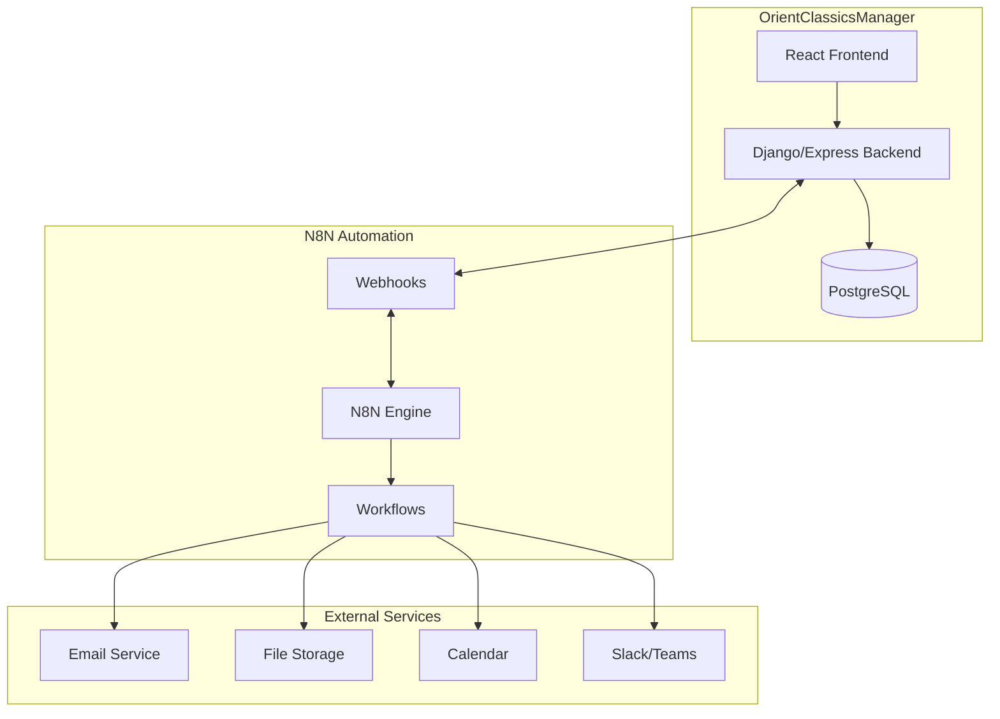

# 🤖 N8N Automation Strategy - OrientClassicsManager

> **Chiến lược tự động hóa** với N8N cho hệ thống quản lý luồng phê duyệt văn bản

## 📋 Mục lục

- [🎯 Tổng quan N8N](#-tổng-quan-n8n)
- [🏗️ Kiến trúc tích hợp](#️-kiến-trúc-tích-hợp)
- [🔄 Workflow Templates](#-workflow-templates)
- [⚙️ Technical Implementation](#️-technical-implementation)
- [📊 Monitoring và Analytics](#-monitoring-và-analytics)
- [🔒 Security Considerations](#-security-considerations)

---

## 🎯 Tổng quan N8N

### Tại sao chọn N8N?

#### Advantages
- ✅ **Open Source** - Không phí license, full control
- ✅ **Visual Workflow Builder** - Drag & drop interface
- ✅ **Rich Integration** - 400+ nodes sẵn có
- ✅ **Self-hosted** - Data privacy và security
- ✅ **Scalable** - Horizontal scaling support
- ✅ **Developer Friendly** - Custom nodes, JavaScript support

#### Use Cases trong OrientClassicsManager
1. **Document Approval Workflows**
2. **Automated Notifications**
3. **Data Synchronization**
4. **Report Generation**
5. **Integration với External Services**

---

## 🏗️ Kiến trúc tích hợp

### System Architecture



### Integration Points

#### 1. Webhook Endpoints
```javascript
// OrientClassicsManager → N8N
POST /webhook/n8n/document-submitted
POST /webhook/n8n/approval-request
POST /webhook/n8n/status-update

// N8N → OrientClassicsManager
POST /api/webhooks/n8n/approval-response
POST /api/webhooks/n8n/notification-sent
POST /api/webhooks/n8n/workflow-completed
```

#### 2. Database Integration
```sql
-- N8N có thể trực tiếp query PostgreSQL
SELECT * FROM contracts WHERE status = 'pending_approval';
UPDATE approval_workflows SET status = 'in_progress' WHERE id = ?;
```

#### 3. API Integration
```javascript
// N8N gọi OrientClassicsManager API
const response = await this.helpers.httpRequest({
  method: 'POST',
  url: 'http://localhost:8000/api/contracts/approve/',
  body: {
    contract_id: contractId,
    approver_id: approverId,
    comments: comments
  }
});
```

---

## 🔄 Workflow Templates

### 1. Contract Approval Workflow

#### Workflow Structure
```json
{
  "name": "Contract Approval Workflow",
  "description": "Automated contract approval process",
  "nodes": [
    {
      "name": "Contract Submitted",
      "type": "n8n-nodes-base.webhook",
      "parameters": {
        "path": "contract-submitted",
        "httpMethod": "POST"
      }
    },
    {
      "name": "Get Contract Details",
      "type": "n8n-nodes-base.postgres",
      "parameters": {
        "query": "SELECT * FROM contracts WHERE id = $1",
        "values": ["{{ $json.contract_id }}"]
      }
    },
    {
      "name": "Send Manager Notification",
      "type": "n8n-nodes-base.emailSend",
      "parameters": {
        "to": "{{ $json.manager_email }}",
        "subject": "Contract Approval Required: {{ $json.contract_number }}",
        "text": "Please review and approve contract {{ $json.contract_number }}"
      }
    },
    {
      "name": "Wait for Manager Response",
      "type": "n8n-nodes-base.wait",
      "parameters": {
        "resume": "webhook",
        "webhookSuffix": "manager-response"
      }
    },
    {
      "name": "Check Manager Decision",
      "type": "n8n-nodes-base.if",
      "parameters": {
        "conditions": {
          "string": [
            {
              "value1": "{{ $json.decision }}",
              "operation": "equal",
              "value2": "approved"
            }
          ]
        }
      }
    }
  ]
}
```

#### Flow Steps
1. **Trigger**: Contract submitted for approval
2. **Data Retrieval**: Get contract details from database
3. **Manager Notification**: Send email to manager
4. **Wait**: Wait for manager response
5. **Decision Check**: Check if approved or rejected
6. **Next Level**: If approved, send to next approver
7. **Final Action**: Update status and notify stakeholders

### 2. Multi-Level Approval Workflow

```javascript
// Dynamic approval levels based on contract value
const approvalLevels = [
  { level: 1, role: 'manager', threshold: 0 },
  { level: 2, role: 'director', threshold: 100000 },
  { level: 3, role: 'ceo', threshold: 500000 }
];

const contractValue = $json.total_amount;
const requiredLevels = approvalLevels.filter(
  level => contractValue >= level.threshold
);
```

### 3. Document Review Workflow

#### Features
- **Parallel Review**: Multiple reviewers simultaneously
- **Deadline Tracking**: Automatic escalation
- **Version Control**: Track document changes
- **Feedback Aggregation**: Collect and summarize feedback

```json
{
  "name": "Document Review Workflow",
  "nodes": [
    {
      "name": "Document Uploaded",
      "type": "n8n-nodes-base.webhook"
    },
    {
      "name": "Split to Reviewers",
      "type": "n8n-nodes-base.splitInBatches",
      "parameters": {
        "batchSize": 1
      }
    },
    {
      "name": "Send Review Request",
      "type": "n8n-nodes-base.emailSend"
    },
    {
      "name": "Wait for All Reviews",
      "type": "n8n-nodes-base.merge",
      "parameters": {
        "mode": "waitForAll"
      }
    },
    {
      "name": "Aggregate Feedback",
      "type": "n8n-nodes-base.function"
    }
  ]
}
```

### 4. Notification Workflow

#### Multi-Channel Notifications
```javascript
// Email notification
await sendEmail({
  to: approver.email,
  subject: `Approval Required: ${document.title}`,
  template: 'approval-request',
  data: { document, approver, deadline }
});

// In-app notification
await createNotification({
  user_id: approver.id,
  type: 'approval_request',
  title: 'New Document Approval',
  message: `Please review ${document.title}`,
  action_url: `/approvals/${document.id}`
});

// Slack notification (if configured)
await sendSlackMessage({
  channel: approver.slack_channel,
  text: `📋 New approval request: ${document.title}`,
  attachments: [{
    color: 'warning',
    fields: [
      { title: 'Document', value: document.title, short: true },
      { title: 'Deadline', value: deadline, short: true }
    ],
    actions: [
      { name: 'approve', text: 'Approve', type: 'button' },
      { name: 'reject', text: 'Reject', type: 'button' }
    ]
  }]
});
```

---

## ⚙️ Technical Implementation

### 1. N8N Setup và Configuration

#### Docker Compose Setup
```yaml
version: '3.8'
services:
  n8n:
    image: n8nio/n8n:latest
    container_name: n8n
    ports:
      - "5678:5678"
    environment:
      - N8N_BASIC_AUTH_ACTIVE=true
      - N8N_BASIC_AUTH_USER=admin
      - N8N_BASIC_AUTH_PASSWORD=your_password
      - WEBHOOK_URL=http://localhost:5678/
      - GENERIC_TIMEZONE=Asia/Ho_Chi_Minh
      - DB_TYPE=postgresdb
      - DB_POSTGRESDB_HOST=postgres
      - DB_POSTGRESDB_PORT=5432
      - DB_POSTGRESDB_DATABASE=n8n
      - DB_POSTGRESDB_USER=n8n_user
      - DB_POSTGRESDB_PASSWORD=n8n_password
    volumes:
      - n8n_data:/home/node/.n8n
    depends_on:
      - postgres
    networks:
      - n8n_network

  postgres:
    image: postgres:13
    container_name: n8n_postgres
    environment:
      - POSTGRES_DB=n8n
      - POSTGRES_USER=n8n_user
      - POSTGRES_PASSWORD=n8n_password
    volumes:
      - postgres_data:/var/lib/postgresql/data
    networks:
      - n8n_network

volumes:
  n8n_data:
  postgres_data:

networks:
  n8n_network:
    driver: bridge
```

#### Environment Variables
```bash
# N8N Configuration
N8N_HOST=0.0.0.0
N8N_PORT=5678
N8N_PROTOCOL=http
N8N_BASIC_AUTH_ACTIVE=true
N8N_BASIC_AUTH_USER=admin
N8N_BASIC_AUTH_PASSWORD=secure_password

# Database
DB_TYPE=postgresdb
DB_POSTGRESDB_HOST=localhost
DB_POSTGRESDB_PORT=5432
DB_POSTGRESDB_DATABASE=n8n
DB_POSTGRESDB_USER=n8n_user
DB_POSTGRESDB_PASSWORD=n8n_password

# Webhooks
WEBHOOK_URL=http://localhost:5678/
N8N_PAYLOAD_SIZE_MAX=16

# Email
N8N_EMAIL_MODE=smtp
N8N_SMTP_HOST=smtp.gmail.com
N8N_SMTP_PORT=587
N8N_SMTP_USER=your_email@gmail.com
N8N_SMTP_PASS=your_app_password
```

### 2. Custom Nodes Development

#### OrientClassicsManager Node
```javascript
// nodes/OrientClassicsManager/OrientClassicsManager.node.ts
import { INodeType, INodeTypeDescription } from 'n8n-workflow';

export class OrientClassicsManager implements INodeType {
  description: INodeTypeDescription = {
    displayName: 'OrientClassicsManager',
    name: 'orientClassicsManager',
    group: ['transform'],
    version: 1,
    description: 'Interact with OrientClassicsManager API',
    defaults: {
      name: 'OrientClassicsManager',
    },
    inputs: ['main'],
    outputs: ['main'],
    credentials: [
      {
        name: 'orientClassicsManagerApi',
        required: true,
      },
    ],
    properties: [
      {
        displayName: 'Operation',
        name: 'operation',
        type: 'options',
        options: [
          {
            name: 'Get Contract',
            value: 'getContract',
          },
          {
            name: 'Update Contract Status',
            value: 'updateContractStatus',
          },
          {
            name: 'Send Notification',
            value: 'sendNotification',
          },
        ],
        default: 'getContract',
      },
    ],
  };

  async execute(this: IExecuteFunctions): Promise<INodeExecutionData[][]> {
    const items = this.getInputData();
    const returnData: INodeExecutionData[] = [];
    const operation = this.getNodeParameter('operation', 0) as string;

    for (let i = 0; i < items.length; i++) {
      try {
        if (operation === 'getContract') {
          // Implementation for getting contract
        } else if (operation === 'updateContractStatus') {
          // Implementation for updating contract status
        }
      } catch (error) {
        if (this.continueOnFail()) {
          returnData.push({ error: error.message });
        } else {
          throw error;
        }
      }
    }

    return [returnData];
  }
}
```

### 3. Webhook Integration

#### Django Webhook Handler
```python
# views.py
from django.http import JsonResponse
from django.views.decorators.csrf import csrf_exempt
from django.views.decorators.http import require_http_methods
import json
import requests

@csrf_exempt
@require_http_methods(["POST"])
def n8n_webhook_handler(request, workflow_type):
    """Handle webhooks from N8N workflows"""
    try:
        data = json.loads(request.body)
        
        if workflow_type == 'approval-response':
            return handle_approval_response(data)
        elif workflow_type == 'notification-sent':
            return handle_notification_sent(data)
        elif workflow_type == 'workflow-completed':
            return handle_workflow_completed(data)
        
        return JsonResponse({'status': 'unknown_workflow_type'}, status=400)
    
    except Exception as e:
        return JsonResponse({'error': str(e)}, status=500)

def handle_approval_response(data):
    """Process approval response from N8N"""
    contract_id = data.get('contract_id')
    decision = data.get('decision')  # 'approved' or 'rejected'
    comments = data.get('comments', '')
    approver_id = data.get('approver_id')
    
    # Update contract status
    contract = Contract.objects.get(id=contract_id)
    
    if decision == 'approved':
        contract.status = 'approved'
        # Trigger next approval level if needed
        trigger_next_approval_level(contract)
    else:
        contract.status = 'rejected'
        # Send rejection notification
        send_rejection_notification(contract, comments)
    
    contract.save()
    
    # Log approval history
    ApprovalHistory.objects.create(
        workflow_id=data.get('workflow_id'),
        approver_id=approver_id,
        action=decision,
        comments=comments
    )
    
    return JsonResponse({'status': 'success'})

def trigger_n8n_workflow(workflow_name, data):
    """Trigger N8N workflow via webhook"""
    webhook_url = f"{settings.N8N_WEBHOOK_URL}/webhook/{workflow_name}"
    
    response = requests.post(webhook_url, json=data)
    
    if response.status_code == 200:
        return response.json()
    else:
        raise Exception(f"N8N workflow trigger failed: {response.text}")
```

### 4. Error Handling và Retry Logic

#### N8N Error Handling
```javascript
// Error handling trong N8N workflow
{
  "name": "Error Handler",
  "type": "n8n-nodes-base.function",
  "parameters": {
    "functionCode": `
      // Check if previous node had error
      if ($input.first().error) {
        // Log error
        console.error('Workflow error:', $input.first().error);
        
        // Send error notification
        return [{
          json: {
            error: true,
            message: $input.first().error,
            timestamp: new Date().toISOString(),
            workflow_id: $workflow.id,
            execution_id: $execution.id
          }
        }];
      }
      
      return $input.all();
    `
  }
}
```

#### Retry Configuration
```json
{
  "name": "HTTP Request with Retry",
  "type": "n8n-nodes-base.httpRequest",
  "parameters": {
    "url": "http://localhost:8000/api/contracts/",
    "method": "POST"
  },
  "retryOnFail": true,
  "maxTries": 3,
  "waitBetweenTries": 1000
}
```

---

## 📊 Monitoring và Analytics

### 1. Workflow Monitoring

#### N8N Execution Tracking
```javascript
// Custom monitoring node
{
  "name": "Workflow Monitor",
  "type": "n8n-nodes-base.function",
  "parameters": {
    "functionCode": `
      const executionData = {
        workflow_id: $workflow.id,
        execution_id: $execution.id,
        start_time: $execution.startedAt,
        status: 'running',
        step_count: $workflow.nodes.length,
        current_step: $node.name
      };
      
      // Send to monitoring system
      $this.helpers.httpRequest({
        method: 'POST',
        url: 'http://localhost:8000/api/monitoring/workflow-execution/',
        body: executionData
      });
      
      return $input.all();
    `
  }
}
```

#### Performance Metrics
```python
# Django monitoring model
class WorkflowExecution(models.Model):
    workflow_id = models.CharField(max_length=100)
    execution_id = models.CharField(max_length=100)
    start_time = models.DateTimeField()
    end_time = models.DateTimeField(null=True)
    status = models.CharField(max_length=20)  # running, completed, failed
    duration = models.DurationField(null=True)
    step_count = models.IntegerField()
    error_message = models.TextField(null=True)
    
    def calculate_duration(self):
        if self.end_time:
            self.duration = self.end_time - self.start_time
            self.save()
```

### 2. Business Metrics

#### Approval Analytics
```sql
-- Average approval time by document type
SELECT 
    document_type,
    AVG(EXTRACT(EPOCH FROM (approved_at - submitted_at))/3600) as avg_hours
FROM approval_workflows 
WHERE status = 'approved'
GROUP BY document_type;

-- Approval success rate
SELECT 
    approver_id,
    COUNT(*) as total_approvals,
    SUM(CASE WHEN action = 'approve' THEN 1 ELSE 0 END) as approved,
    ROUND(
        SUM(CASE WHEN action = 'approve' THEN 1 ELSE 0 END) * 100.0 / COUNT(*), 
        2
    ) as approval_rate
FROM approval_history
GROUP BY approver_id;

-- Workflow bottlenecks
SELECT 
    step_number,
    AVG(EXTRACT(EPOCH FROM (created_at - LAG(created_at) OVER (
        PARTITION BY workflow_id ORDER BY step_number
    )))/3600) as avg_step_duration_hours
FROM approval_history
GROUP BY step_number
ORDER BY avg_step_duration_hours DESC;
```

### 3. Dashboard và Reporting

#### Real-time Dashboard
```typescript
// React Dashboard Component
interface WorkflowMetrics {
  total_workflows: number;
  active_workflows: number;
  completed_today: number;
  average_completion_time: number;
  success_rate: number;
}

const WorkflowDashboard: React.FC = () => {
  const [metrics, setMetrics] = useState<WorkflowMetrics>();
  
  useEffect(() => {
    // Fetch real-time metrics
    fetchWorkflowMetrics().then(setMetrics);
    
    // Setup WebSocket for real-time updates
    const ws = new WebSocket('ws://localhost:8000/ws/workflow-metrics/');
    ws.onmessage = (event) => {
      const data = JSON.parse(event.data);
      setMetrics(data.metrics);
    };
    
    return () => ws.close();
  }, []);
  
  return (
    <div className="dashboard">
      <MetricCard 
        title="Active Workflows" 
        value={metrics?.active_workflows} 
        icon="⚡" 
      />
      <MetricCard 
        title="Completed Today" 
        value={metrics?.completed_today} 
        icon="✅" 
      />
      <MetricCard 
        title="Avg Completion Time" 
        value={`${metrics?.average_completion_time}h`} 
        icon="⏱️" 
      />
      <MetricCard 
        title="Success Rate" 
        value={`${metrics?.success_rate}%`} 
        icon="📈" 
      />
    </div>
  );
};
```

---

## 🔒 Security Considerations

### 1. Authentication và Authorization

#### N8N Security
```yaml
# docker-compose.yml security settings
environment:
  - N8N_BASIC_AUTH_ACTIVE=true
  - N8N_BASIC_AUTH_USER=${N8N_USER}
  - N8N_BASIC_AUTH_PASSWORD=${N8N_PASSWORD}
  - N8N_JWT_AUTH_ACTIVE=true
  - N8N_JWT_AUTH_HEADER=authorization
  - N8N_ENCRYPTION_KEY=${N8N_ENCRYPTION_KEY}
```

#### Webhook Security
```python
# Django webhook security
import hmac
import hashlib

def verify_n8n_webhook(request):
    """Verify webhook signature from N8N"""
    signature = request.headers.get('X-N8N-Signature')
    if not signature:
        return False
    
    expected_signature = hmac.new(
        settings.N8N_WEBHOOK_SECRET.encode(),
        request.body,
        hashlib.sha256
    ).hexdigest()
    
    return hmac.compare_digest(signature, expected_signature)

@csrf_exempt
def secure_webhook_handler(request):
    if not verify_n8n_webhook(request):
        return JsonResponse({'error': 'Invalid signature'}, status=401)
    
    # Process webhook
    return process_webhook(request)
```

### 2. Data Protection

#### Sensitive Data Handling
```javascript
// N8N function node for data sanitization
{
  "name": "Sanitize Data",
  "type": "n8n-nodes-base.function",
  "parameters": {
    "functionCode": `
      const sensitiveFields = ['password', 'ssn', 'credit_card'];
      
      function sanitizeObject(obj) {
        const sanitized = { ...obj };
        
        for (const field of sensitiveFields) {
          if (sanitized[field]) {
            sanitized[field] = '***REDACTED***';
          }
        }
        
        return sanitized;
      }
      
      return $input.all().map(item => ({
        json: sanitizeObject(item.json)
      }));
    `
  }
}
```

#### Encryption
```python
# Django encryption for sensitive workflow data
from cryptography.fernet import Fernet

class EncryptedWorkflowData(models.Model):
    workflow_id = models.CharField(max_length=100)
    encrypted_data = models.BinaryField()
    created_at = models.DateTimeField(auto_now_add=True)
    
    def set_data(self, data):
        """Encrypt and store data"""
        key = settings.WORKFLOW_ENCRYPTION_KEY
        f = Fernet(key)
        self.encrypted_data = f.encrypt(json.dumps(data).encode())
    
    def get_data(self):
        """Decrypt and return data"""
        key = settings.WORKFLOW_ENCRYPTION_KEY
        f = Fernet(key)
        decrypted = f.decrypt(self.encrypted_data)
        return json.loads(decrypted.decode())
```

### 3. Audit Trail

#### Comprehensive Logging
```python
# Workflow audit model
class WorkflowAuditLog(models.Model):
    workflow_id = models.CharField(max_length=100)
    execution_id = models.CharField(max_length=100)
    action = models.CharField(max_length=50)
    user_id = models.ForeignKey(User, on_delete=models.SET_NULL, null=True)
    ip_address = models.GenericIPAddressField()
    user_agent = models.TextField()
    timestamp = models.DateTimeField(auto_now_add=True)
    details = models.JSONField()
    
    class Meta:
        indexes = [
            models.Index(fields=['workflow_id', 'timestamp']),
            models.Index(fields=['user_id', 'timestamp']),
        ]
```

---

## 🚀 Deployment Strategy

### 1. Development Environment
```bash
# Local development setup
git clone https://github.com/your-org/orient-classics-manager
cd orient-classics-manager

# Start N8N
docker-compose -f docker-compose.dev.yml up -d n8n

# Import workflow templates
n8n import:workflow --input=./n8n-workflows/
```

### 2. Production Deployment
```yaml
# docker-compose.prod.yml
version: '3.8'
services:
  n8n:
    image: n8nio/n8n:latest
    restart: unless-stopped
    environment:
      - N8N_HOST=${N8N_HOST}
      - N8N_PORT=5678
      - N8N_PROTOCOL=https
      - WEBHOOK_URL=https://${N8N_HOST}/
      - N8N_ENCRYPTION_KEY=${N8N_ENCRYPTION_KEY}
    volumes:
      - n8n_data:/home/node/.n8n
    networks:
      - traefik
    labels:
      - "traefik.enable=true"
      - "traefik.http.routers.n8n.rule=Host(`${N8N_HOST}`)"
      - "traefik.http.routers.n8n.tls.certresolver=letsencrypt"
```

### 3. Backup và Recovery
```bash
#!/bin/bash
# N8N backup script

# Backup workflows
n8n export:workflow --output=./backups/workflows-$(date +%Y%m%d).json --all

# Backup credentials (encrypted)
n8n export:credentials --output=./backups/credentials-$(date +%Y%m%d).json --all

# Backup database
pg_dump n8n > ./backups/n8n-db-$(date +%Y%m%d).sql

# Upload to cloud storage
aws s3 cp ./backups/ s3://your-backup-bucket/n8n/ --recursive
```

---

*Tài liệu này cung cấp framework hoàn chỉnh để triển khai N8N automation cho OrientClassicsManager. Các workflow templates và implementation details có thể được tùy chỉnh theo nhu cầu cụ thể của dự án.*

**Phiên bản**: 1.0  
**Ngày cập nhật**: 27/11/2024  
**Trạng thái**: Ready for Implementation
