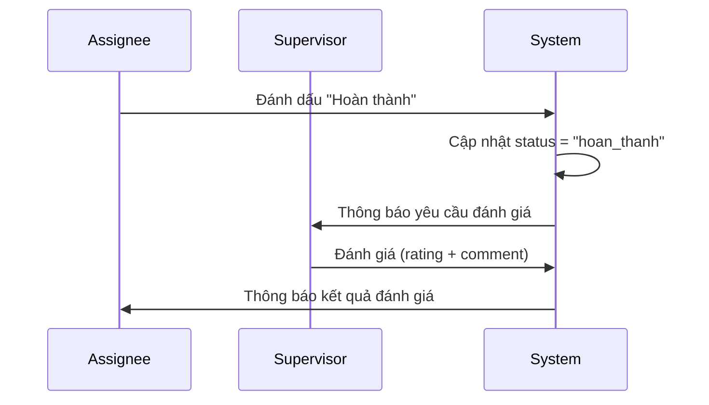
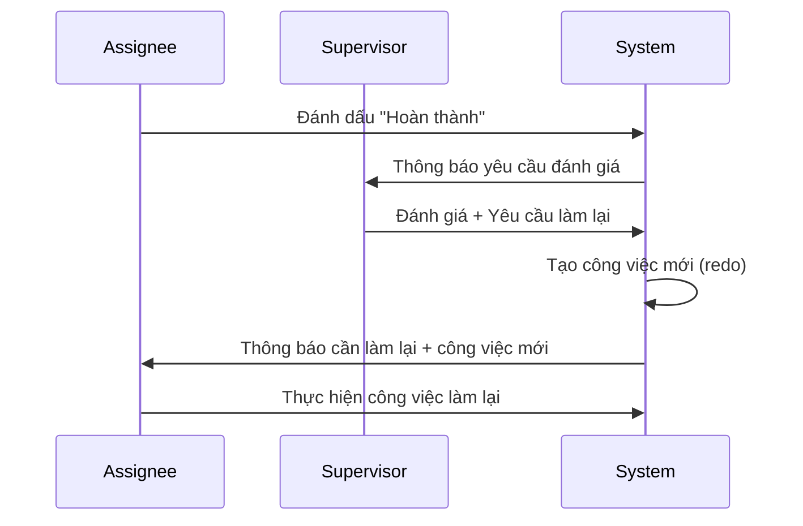

# Tính năng Đánh giá và Làm lại - Orient Classics Manager

## 🎯 Tổng quan

Hệ thống đã được bổ sung các tính năng đánh giá chất lượng và yêu cầu làm lại công việc theo yêu cầu:

### ✨ Các tính năng mới

1. **Đánh dấu hoàn thành và thông báo Supervisor**
   - Assignee có thể đánh dấu công việc hoàn thành
   - Supervisor tự động nhận thông báo yêu cầu đánh giá
   - Cập nhật trạng thái và tiến độ 100%

2. **Đánh giá chất lượng nâng cao**
   - Supervisor đánh giá bằng thang điểm 5 sao
   - Thêm bình luận chi tiết về chất lượng
   - Lưu trữ ngày đánh giá và lịch sử

3. **Chức năng yêu cầu làm lại**
   - Supervisor có thể yêu cầu làm lại nếu chất lượng không đạt
   - Tự động tạo công việc mới với thông tin sao chép
   - Theo dõi số lần làm lại và lý do
   - Ghi chú rõ ràng về mối quan hệ với công việc gốc

4. **Hệ thống thông báo mở rộng**
   - Thông báo khi công việc hoàn thành (cho Supervisor)
   - Thông báo khi được đánh giá (cho Assignee)
   - Thông báo khi cần làm lại (cho Assignee)
   - Phân loại thông báo rõ ràng

5. **Theo dõi lịch sử và thống kê**
   - Lưu trữ tất cả đánh giá cho báo cáo định kỳ
   - Theo dõi xu hướng chất lượng công việc
   - Thống kê số lần làm lại theo nhân viên/dự án

## 🔧 Cấu trúc kỹ thuật

### Backend (Django)

#### Models đã cập nhật:

**WorkTask** (thêm các trường mới):
```python
# Redo functionality
is_redo = models.BooleanField(default=False)
original_task = models.ForeignKey('self', ...)
redo_count = models.PositiveIntegerField(default=0)
redo_reason = models.TextField(blank=True)
```

**TaskNotification** (thêm loại thông báo mới):
```python
NOTIFICATION_TYPE_CHOICES = [
    # ... existing choices ...
    ('completion_review', 'Yêu cầu đánh giá hoàn thành'),
    ('redo_required', 'Yêu cầu làm lại'),
    ('evaluation', 'Đánh giá'),
]
```

#### Phương thức mới:

**WorkTask.evaluate_task()**:
```python
def evaluate_task(self, supervisor_user, rating, comment, require_redo=False, redo_reason=""):
    """Đánh giá công việc và có thể yêu cầu làm lại"""
    # Lưu đánh giá
    # Tạo công việc làm lại nếu cần
    # Gửi thông báo
```

**WorkTask.create_redo_task()**:
```python
def create_redo_task(self, reason=""):
    """Tạo công việc làm lại từ công việc hiện tại"""
    # Sao chép thông tin công việc
    # Tăng số lần làm lại
    # Cập nhật tiêu đề và ghi chú
```

**WorkTask.mark_completed_and_notify_supervisor()**:
```python
def mark_completed_and_notify_supervisor(self):
    """Đánh dấu hoàn thành và thông báo cho supervisor"""
    # Gửi thông báo yêu cầu đánh giá
```

#### API Endpoints mới:

- `POST /api/v1/works/tasks/{id}/evaluate_task/`: Đánh giá công việc (có thể yêu cầu làm lại)
- `POST /api/v1/works/tasks/{id}/mark_completed/`: Đánh dấu hoàn thành và thông báo supervisor

#### Request/Response mới:

**Evaluate Task Request**:
```json
{
  "rating": 3,
  "comment": "Cần cải thiện chất lượng",
  "require_redo": true,
  "redo_reason": "Thiếu chi tiết trong phần phân tích"
}
```

**Evaluate Task Response**:
```json
{
  "status": "success",
  "message": "Đã đánh giá công việc với 3 sao. Đã tạo công việc làm lại với ID #123",
  "task": { /* WorkTask object */ },
  "redo_task": { /* New WorkTask object */ }
}
```

### Frontend (React + TypeScript)

#### Interface cập nhật:

**WorkTask**:
```typescript
export interface WorkTask {
  // ... existing fields ...
  is_redo?: boolean;
  original_task?: number;
  original_task_title?: string;
  redo_count?: number;
  redo_reason?: string;
}
```

#### Components mới:

**TaskEvaluationForm**:
- Form đánh giá với rating 5 sao
- Checkbox yêu cầu làm lại
- Input lý do làm lại
- Validation và error handling

**TaskActions** (cập nhật):
- Nút "Hoàn thành" cho Assignee
- Nút "Đánh giá" cho Supervisor (sử dụng TaskEvaluationForm)
- Logic hiển thị dựa trên quyền và trạng thái

#### API Client methods mới:

```typescript
async evaluateWorkTask(id, data): Promise<EvaluationResponse>
async markWorkTaskCompleted(id): Promise<CompletionResponse>
```

## 🚀 Workflow sử dụng

### 1. Quy trình hoàn thành và đánh giá



### 2. Quy trình yêu cầu làm lại



## 📊 Giao diện người dùng

### 1. Nút hành động

**Cho Assignee**:
- 🟢 **"Hoàn thành"**: Đánh dấu công việc hoàn thành
- 📝 **"Yêu cầu điều chỉnh"**: Yêu cầu thay đổi thông tin

**Cho Supervisor**:
- 🏆 **"Đánh giá"**: Đánh giá chất lượng công việc
- ⚙️ **"Giao việc"**: Giao việc cho người khác

### 2. Hiển thị thông tin

**Công việc làm lại**:
```
🔄 Công việc làm lại
├─ Làm lại từ: [Tên công việc gốc]
├─ Lần làm lại thứ: 2
└─ Lý do: Cần bổ sung thêm chi tiết phân tích
```

**Đánh giá chất lượng**:
```
⭐ Đánh giá chất lượng
├─ Điểm đánh giá: ★★★☆☆ (3/5 sao)
├─ Bình luận: Cần cải thiện chất lượng hình ảnh
└─ Ngày đánh giá: 26/11/2024
```

### 3. Form đánh giá

- **Rating**: Click vào sao để chọn điểm (1-5)
- **Comment**: Textarea cho bình luận chi tiết
- **Require Redo**: Checkbox yêu cầu làm lại
- **Redo Reason**: Textarea lý do làm lại (bắt buộc nếu chọn làm lại)

## 🔒 Phân quyền và bảo mật

### Quyền đánh dấu hoàn thành:
- ✅ **Assignee**: Có thể đánh dấu công việc được giao hoàn thành
- ❌ **Người khác**: Không thể đánh dấu hoàn thành

### Quyền đánh giá:
- ✅ **Supervisor**: Có thể đánh giá công việc đã hoàn thành
- ❌ **Assignee**: Không thể tự đánh giá công việc của mình
- ❌ **Người khác**: Không thể đánh giá công việc không phải do mình giám sát

### Quyền tạo công việc làm lại:
- ✅ **Supervisor**: Có thể yêu cầu làm lại khi đánh giá
- ❌ **Assignee**: Không thể tự tạo công việc làm lại

## 📈 Báo cáo và thống kê

### Dữ liệu được lưu trữ:
- **Đánh giá**: Rating, comment, ngày đánh giá
- **Làm lại**: Số lần, lý do, mối quan hệ với công việc gốc
- **Thông báo**: Lịch sử tất cả thông báo liên quan

### Có thể báo cáo:
- **Chất lượng công việc theo nhân viên**: Điểm trung bình, xu hướng
- **Tỷ lệ làm lại**: Theo nhân viên, dự án, thời gian
- **Hiệu suất supervisor**: Tần suất đánh giá, chất lượng feedback
- **Thống kê thông báo**: Tỷ lệ đọc, thời gian phản hồi

## 🔄 Migration và tương thích

### Database Migration:
```bash
cd backend-django
python manage.py migrate
```

Migration `0009_add_redo_evaluation_features` sẽ:
- Thêm các trường mới vào bảng `work_tasks`
- Cập nhật choices cho `task_notifications`
- Tạo indexes cần thiết
- Không ảnh hưởng dữ liệu hiện có

### Tương thích ngược:
- ✅ Tất cả công việc hiện có vẫn hoạt động bình thường
- ✅ Các trường mới có giá trị mặc định hợp lý
- ✅ API cũ vẫn hoạt động (chỉ thêm fields mới)

## 🎨 UI/UX Improvements

### Color Coding:
- 🟢 **Xanh lá**: Hoàn thành, đánh giá tích cực
- 🟡 **Vàng**: Đang chờ đánh giá, cảnh báo
- 🟠 **Cam**: Làm lại, cần chú ý
- 🔴 **Đỏ**: Lỗi, từ chối

### Icons:
- 🏆 **Award**: Đánh giá chất lượng
- ✅ **CheckCircle**: Hoàn thành
- 🔄 **RotateCcw**: Làm lại
- 📝 **Edit**: Chỉnh sửa
- 🔔 **Bell**: Thông báo

### Responsive Design:
- Form đánh giá tối ưu cho mobile
- Dialog responsive trên các kích thước màn hình
- Touch-friendly star rating

## 🔮 Tương lai và mở rộng

### Tính năng có thể thêm:
- **Workflow tự động**: Tự động giao việc làm lại
- **Template đánh giá**: Mẫu bình luận có sẵn
- **Escalation**: Tự động báo cáo khi quá nhiều lần làm lại
- **Analytics**: Dashboard thống kê chất lượng
- **Integration**: Kết nối với hệ thống HR để đánh giá nhân viên

### Performance:
- Index database cho queries thống kê
- Cache kết quả đánh giá thường xuyên
- Pagination cho lịch sử làm lại

### Security:
- Audit log cho tất cả hành động đánh giá
- Rate limiting cho API endpoints
- Validation nghiêm ngặt cho input data
